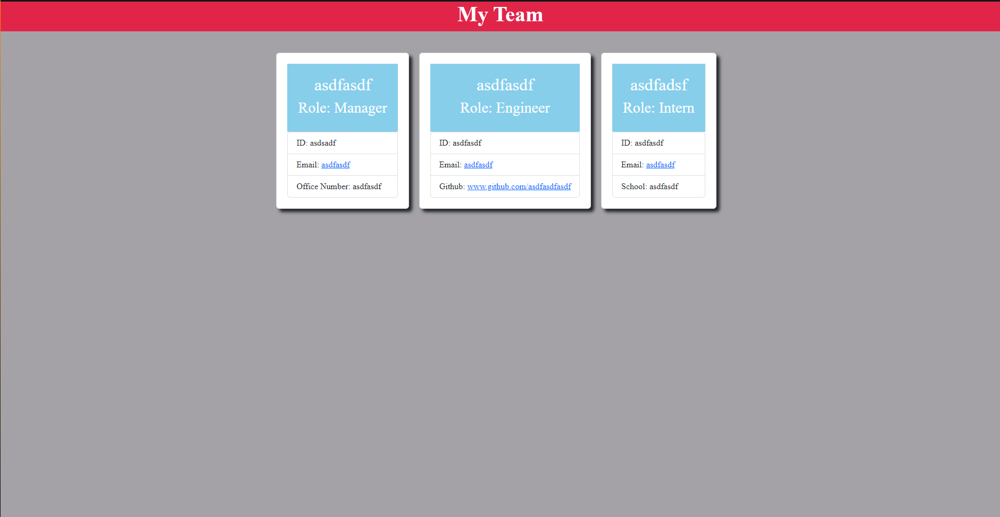

 # Team-Profile-Generator

## Table of Contents

- [Description](#description)
- [Installation](#installation)
- [Usage](#usage)
- [Credits](#Credits)
- [Features](#features)
- [Additional Info](#additional-info)

## Description:
Application that will generate a profile for a current/upcoming team, based on user input.

## Static Site:

## Video Demonstrating App:
- https://watch.screencastify.com/v/49sU9JnDz32hmwznqcGy

## Installation:
- Download the ZIP file or clone the repository

## Usage:
- Open in the Terminal or in Bash
- Make sure you are in the right folder-path.
- Type/Run 'node Develop/index.js
- Answer the following questionnaire.
- When completed a 'index.html' will be added to the folder.

## Credits:
Amir Rezvani

## Additional Info:

- Github: [AREZVANI95](https://github.com/AREZVANI95)

- Email: Amir95@Gmail.com
